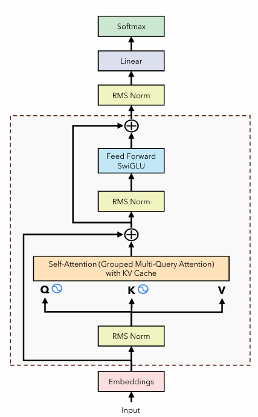

# llama2-implementation

#### Inference Stratgey 

1. Greedy: Takes the next token with the highest P(.), but may not achieve global optimality, since future tokens could be bad after this selection 

2. Beam Search: Takes the top k next tokens, then generate the next step, and multiply the P(wn) * P(wn+1) for all candidates, and take max(P(wn) * P(wn+1)). But costly during inference 

3. Random sampling: We want randomness. Hence if the distribution is [0.4, 0.3, 0.2...], choose the token based on their probability, but may lead to rubbish tokens (may still select tokens that have low p(.))

4. Top K sampling. Sort the tokens based on probability, take the top k, then randomly choose one similar to random sampling. But if we have the case [0.95, 0.03, 0.01], we may still select 0.03, and hence rubbish 

5. Top P sampling. Sort the tokens based on probability, then take the tokens such that this token's cumulative sum of probability = P. Hence we would limit the token that are rubbish, but may still be present. 